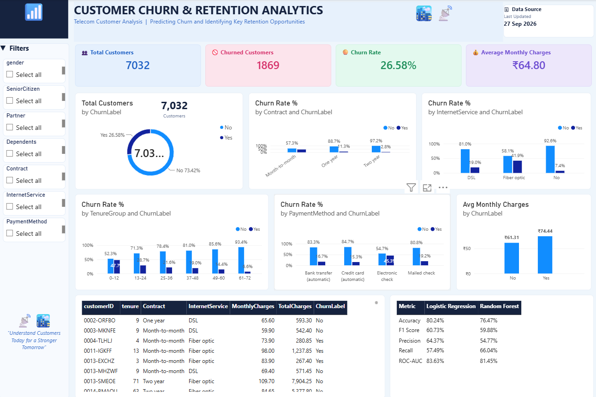

# Customer Churn Prediction & Retention Analytics

A data analytics and machine learning project that analyzes telecom customer churn, identifies important churn patterns, and provides insights for customer retention using Python, SQL Server, Machine Learning, and Power BI.

## Dashboard Preview

---

## Project Overview

Customer churn is an important business problem for telecom companies. This project analyzes customer information and identifies patterns related to customer churn.

The project combines:

- Python for data cleaning, EDA and machine learning
- SQL Server for data storage and analysis
- Power BI for interactive dashboard development
- Machine Learning for churn prediction

The main objective is to understand which customer groups have higher churn rates and provide useful insights for retention strategies.

---

## Project Functionalities

### 1. Data Cleaning
- Loaded the IBM Telco Customer Churn dataset
- Handled missing values
- Converted `TotalCharges` into numeric format
- Removed duplicate records
- Encoded the churn target variable
- Prepared a cleaned dataset for analysis

### 2. Exploratory Data Analysis
Analyzed churn patterns based on:

- Contract type
- Internet service
- Payment method
- Customer tenure
- Senior citizen status
- Monthly charges
- Overall churn distribution

### 3. SQL Analysis
SQL Server was used to store and analyze the cleaned customer data.

Key analysis includes:

- Total customers
- Churned customers
- Churn rate
- Average monthly charges
- Average customer tenure
- Churn by contract
- Churn by internet service
- Churn by payment method
- Churn by tenure group
- Churn by senior citizen status

### 4. Machine Learning
Two classification models were implemented:

- Logistic Regression
- Random Forest

The models were evaluated using:

- Accuracy
- Precision
- Recall
- F1 Score
- ROC-AUC

### 5. Power BI Dashboard
An interactive Power BI dashboard was created to visualize customer churn and retention insights.

Dashboard includes:

- Total Customers
- Churned Customers
- Churn Rate
- Average Monthly Charges
- Customer Churn Distribution
- Churn Rate by Contract Type
- Churn Rate by Internet Service
- Churn Rate by Tenure
- Churn Rate by Payment Method
- Average Monthly Charges by Churn
- Customer Details
- ML Model Performance
- Interactive filters

---

## Machine Learning Results

| Model | Accuracy | Precision | Recall | F1 Score | ROC-AUC |
|---|---:|---:|---:|---:|---:|
| Logistic Regression | 80.24% | 64.37% | 57.49% | 60.73% | 83.63% |
| Random Forest | 76.47% | 54.77% | 66.04% | 59.88% | 81.45% |

Both models were evaluated using the same churn classification task. Recall is particularly useful for identifying customers who actually churned.

---

## Key Dataset Information

- Dataset: IBM Telco Customer Churn
- Original Records: 7,043
- Cleaned Records: 7,032
- Features: 20 input features
- Target Variable: `Churn`

### Churn Distribution

- No Churn: 5,163 customers
- Churn: 1,869 customers
- Overall Churn Rate: 26.58%

---

## Technologies Used

### Programming & Analysis
- Python
- Pandas
- Matplotlib
- Scikit-learn

### Database
- Microsoft SQL Server
- SQL

### Visualization
- Microsoft Power BI

### Machine Learning
- Logistic Regression
- Random Forest

### Tools
- VS Code
- SQL Server Management Studio
- GitHub
- GitHub Desktop

---

└── README.md
